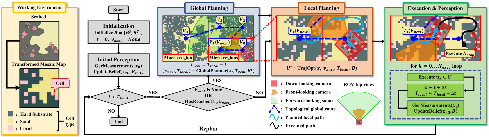
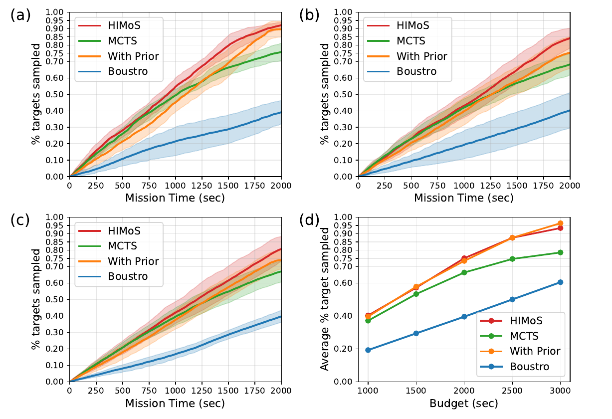

# HIMoS

HIMoS is the codebase for **Hierarchical Multi-Modal Planning for Fixed-Altitude Sparse Target Search and Sampling**. It simulates an AUV searching for sparse coral targets on fixed-altitude reef maps, using a hierarchical planner that combines long-horizon region selection with short-horizon multi-modal sensing and sampling.

The project entry point is [main_game.py](main_game.py). Core experiment and planner parameters are collected in [param.py](param.py). Map data and map-generation details are described separately in [map/README.md](map/README.md).

<p align="center">
  
</p>

## Project Overview

HIMoS targets sparse benthic search-and-sampling missions, where exhaustive coverage is inefficient and high-altitude visual search is unreliable in turbid water. The simulator models a fixed-altitude AUV with three sensing modalities:

- **FLS**: forward-looking sonar for long-range substrate scouting.
- **FLC**: front-looking camera for mid-range coral target scouting.
- **DLC**: down-looking camera for close-range deterministic target confirmation.

The planner has two layers:

- **Global Planner**: builds an adaptive topological planning graph, estimates promising hard-substrate regions from the substrate belief map, and solves an orienteering-style routing problem under the remaining time budget.
- **Local Planner**: runs receding-horizon trajectory optimization with differentiable belief dynamics, balancing substrate exploration, target search, and close-range coral confirmation.

During execution, the robot repeatedly observes the map, updates its belief, replans locally every few control steps, and asks the global planner for a new region once the current target region is reached.

## Visuals

**System overview**



**Simulation and performance**

<table>
  <tr>
    <td width="50%" align="center">
      
    </td>
    <td width="50%" align="center">
      
    </td>
  </tr>
  <tr>
    <td align="center">HIMoS simulation dashboard</td>
    <td align="center">Target confirmation ratio</td>
  </tr>
</table>

**Field data and planning maps**

<table>
  <tr>
    <td width="50%" align="center">
      
    </td>
    <td width="50%" align="center">
      
    </td>
  </tr>
  <tr>
    <td align="center">Survey field and dataset source</td>
    <td align="center">Easy, medium, and hard planning maps</td>
  </tr>
</table>

## Repository Structure

```text
.
├── main_game.py        # Main simulator and autonomous planning loop
├── param.py            # Sensor, robot, planner, visualization, and logging parameters
├── himos.yml           # Minimal conda environment file
├── planner/
│   ├── global_planner.py      # Adaptive global planner and OP target selection
│   ├── local_planner.py       # CasADi-based local trajectory optimizer
│   ├── belief_map.py          # Bayesian belief update and local map snapshots
│   ├── op_solver.py           # Numba-accelerated OP heuristic solver
│   └── mcts_planner.py        # MCTS baseline utilities
├── simulation/
│   ├── coral_map.py           # Ground-truth map and sensor observation simulation
│   ├── robot.py               # Omnidirectional AUV kinematics
│   └── input_controller.py    # Manual control helper
└── map/
    ├── README.md              # Map data and planning-map generation notes
    ├── process_segmentation_50m.py
    └── planning_maps/         # Generated 50 m x 50 m planning maps
```

## Installation

Create the base environment from the provided conda file:

```bash
conda env create -f himos.yml
conda activate ml
```

Install the Python packages used by the simulator and planners:

```bash
pip install numpy pygame matplotlib scikit-learn numba casadi
```

The code is written for Python 3.8. `casadi` is required by the local nonlinear optimizer, `numba` accelerates the orienteering solver, and `pygame` provides the simulator dashboard.

## Quick Start

Run the default autonomous HIMoS simulation:

```bash
python main_game.py
```

The default run uses:

- time budget: `2000` seconds
- map: `map/planning_maps/Area_2_map_1/map.npy`
- start pose: index `0`

You can change these from the command line:

```bash
python main_game.py -budget 1000 -map_index 5 -start_pose 2
```

Arguments:

- `-budget`: total mission time budget in simulated seconds.
- `-map_index`: selects `map/planning_maps/Area_2_map_<index>/map.npy`.
- `-start_pose`: selects one of four corner start poses, indexed `0` to `3`.

While the Pygame window is open, press `G` to toggle the global-planner interest-grid overlay. After a run ends, press `Q`, `Esc`, or close the window to exit.

## Headless or Batch Runs

For non-interactive runs, edit [param.py](param.py):

```python
SHOW_VIS = False
```

When `SHOW_VIS` is disabled, `main_game.py` sets the SDL video driver to `dummy`, so the simulator can run without opening a display window.

## Important Parameters

Most experiment knobs are in [param.py](param.py):

- `CELL_SIZE`: map resolution in meters per cell.
- `FLS_RANGE`, `FLS_FOV_DEG`: sonar range and field of view.
- `FLC_RANGE`, `FLC_FOV_DEG`: forward camera range and field of view.
- `DLC_FOOTPRINT`: down-looking confirmation footprint size.
- `MAX_VELOCITY`, `MAX_ANGULAR_VELOCITY`: AUV control limits.
- `PLANNING_TIMESTEP_SIZE`: local-planner timestep.
- `NEXEC`: number of local controls executed before replanning.
- `GRID_TIME_SEC`: conversion from global-grid transitions to local time budget.
- `GlobalPlannerConfig`: global graph spacing, UCB exploration weight, GP settings, and node splitting threshold.
- `SHOW_VIS`, `RECORD_FRAMES`, `OUTPUT_DIR`: visualization and logging options.

The total mission budget is set from the command line in [main_game.py](main_game.py), then converted to the global-planner path budget with:

```python
path_budget = TOTAL_TIME_BUDGET_SECS / GRID_TIME_SEC
```

## Maps

Planning maps are stored as `.npy` grids with three classes:

- `0`: sand / traversable background
- `1`: rock or hard substrate
- `2`: coral target

The default runner currently expects maps under:

```text
map/planning_maps/Area_2_map_<index>/map.npy
```

For details about the source dataset, class conversion, and how to generate new planning maps, see [map/README.md](map/README.md).

## Outputs

Each run creates an experiment folder under `experiment_results/`, named like:

```text
experiment_results/exp_map<map_index>_start<start_pose>_budget<budget>_<timestamp>/
```

The saved files include:

- `summary.txt`: final confirmation ratio, path length, final pose, and run metadata.
- `coral_timeseries.csv`: confirmed-coral count and robot pose over simulated time.
- `trajectory.npy` and `trajectory.txt`: executed robot trajectory.
- `gt_with_trajectory.png`: ground-truth map with executed trajectory.
- `simulation_observed.png`: final observed map.
- `frames/`, `frames_full_observed/`, `frames_global_planner/`: optional frame outputs when `RECORD_FRAMES = True`.

## Notes for Development

- The autonomous mode is `game.run_planner_HIMoS()` in [main_game.py](main_game.py).
- Manual control support exists through `game.run_manual()` and `simulation/input_controller.py`, but the default entry point runs the autonomous planner.
- If you change map resolution or map size, check `CELL_SIZE`, `GlobalPlannerConfig.grid_interval_m`, and the map path logic in `main_game.py`.
- If local optimization is slow, first reduce `N_INFO`, increase entropy-map downsampling, or shorten the mission budget for debugging.

## Paper

This repository accompanies:

**Hierarchical Multi-Modal Planning for Fixed-Altitude Sparse Target Search and Sampling**

The paper PDF is included in this repository as [Hierarchical_Multi_Modal_Planning_for_Fixed_Altitude_Sparse_Target_Search_and_Sampling.pdf](Hierarchical_Multi_Modal_Planning_for_Fixed_Altitude_Sparse_Target_Search_and_Sampling.pdf).
