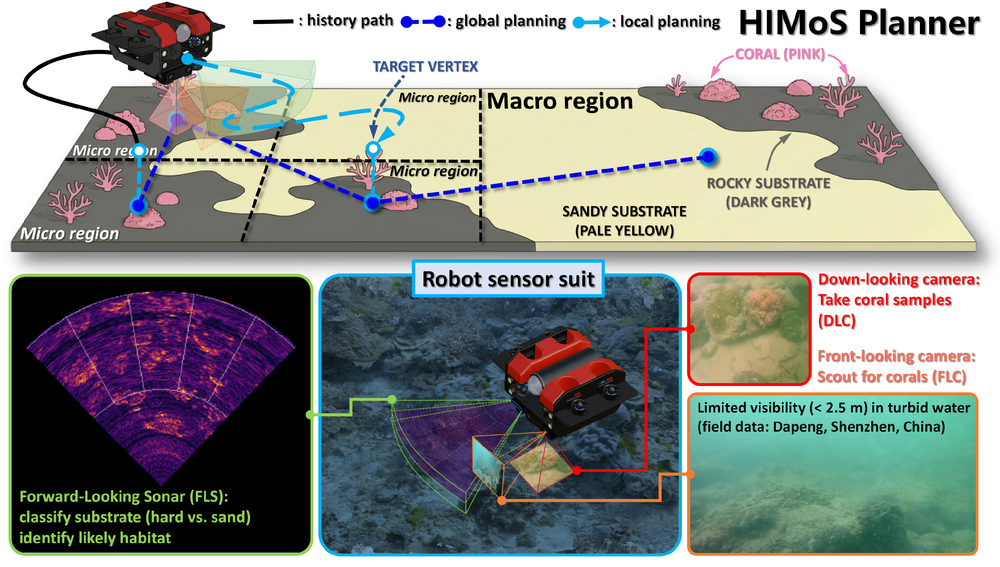
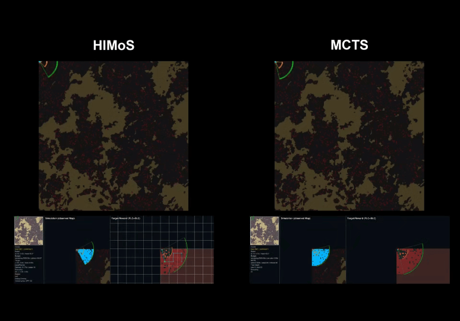
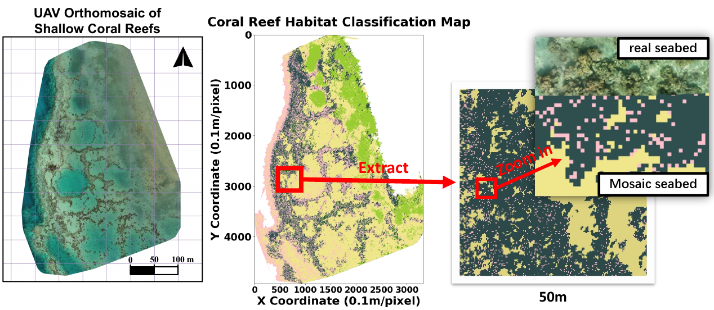
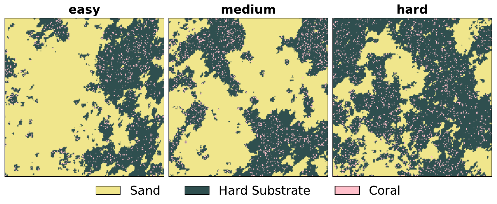

# HIMoS

HIMoS is the codebase for **Hierarchical Multi-Modal Planning for Fixed-Altitude Sparse Target Search and Sampling**. It simulates a fixed-altitude AUV searching for sparse coral targets with multi-modal sensing and hierarchical global-local planning.

<p align="center">
  
</p>

## Overview

HIMoS targets sparse benthic search-and-sampling missions where exhaustive coverage is inefficient and high-altitude vision is unreliable. The robot uses:

- **FLS** for long-range substrate scouting.
- **FLC** for mid-range coral target scouting.
- **DLC** for close-range target confirmation.

The global planner selects promising reef regions under the remaining time budget, while the local planner optimizes short-horizon trajectories for exploration, visual search, and sampling. The system runs in a closed loop: sense, update belief, locally replan, and request a new global target when the current region is reached.

## Demo

<p align="center">
  
</p>

## Data and Maps

<table>
  <tr>
    <td width="50%" align="center">
      
    </td>
    <td width="50%" align="center">
      
    </td>
  </tr>
  <tr>
    <td align="center">Survey field and dataset source</td>
    <td align="center">Representative planning maps</td>
  </tr>
</table>

Map data and map-generation details are documented in [map/README.md](map/README.md).

## Installation

```bash
conda env create -f himos.yml
conda activate himos
```

The conda environment uses Python 3.8 and includes the runtime dependencies needed by the simulator and planners.

## Quick Start

The project entry point is [main_game.py](main_game.py). Main experiment settings are in [param.py](param.py).

Run the default autonomous HIMoS simulation:

```bash
python main_game.py
```

Run a different budget, map, or start pose:

```bash
python main_game.py -budget 1000 -map_index 5 -start_pose 2
```

Arguments:

- `-budget`: total mission time budget in simulated seconds.
- `-map_index`: selects `map/planning_maps/Area_2_map_<index>/map.npy`.
- `-start_pose`: selects one of four corner start poses, indexed `0` to `3`.


For non-interactive runs, set `SHOW_VIS = False` in [param.py](param.py). Frame sequences are saved only when `RECORD_FRAMES = True`.

## Outputs

Each run creates an experiment folder under `experiment_results/`:

```text
experiment_results/exp_map<map_index>_start<start_pose>_budget<budget>_<timestamp>/
```

Saved outputs include `summary.txt`, `coral_timeseries.csv`, `trajectory.npy`, `trajectory.txt`, `gt_with_trajectory.png`, and `simulation_observed.png`. Optional frame folders are written only when `RECORD_FRAMES = True`.

## Citation

```bibtex
@misc{chen2026hierarchicalmultimodalplanningfixedaltitude,
      title={Hierarchical Multi-Modal Planning for Fixed-Altitude Sparse Target Search and Sampling}, 
      author={Lingpeng Chen and Yuchen Zheng and Apple Pui-Yi Chui and Junfeng Wu and Ziyang Hong},
      year={2026},
      eprint={2603.08336},
      archivePrefix={arXiv},
      primaryClass={cs.RO},
      url={https://arxiv.org/abs/2603.08336}, 
}
```
